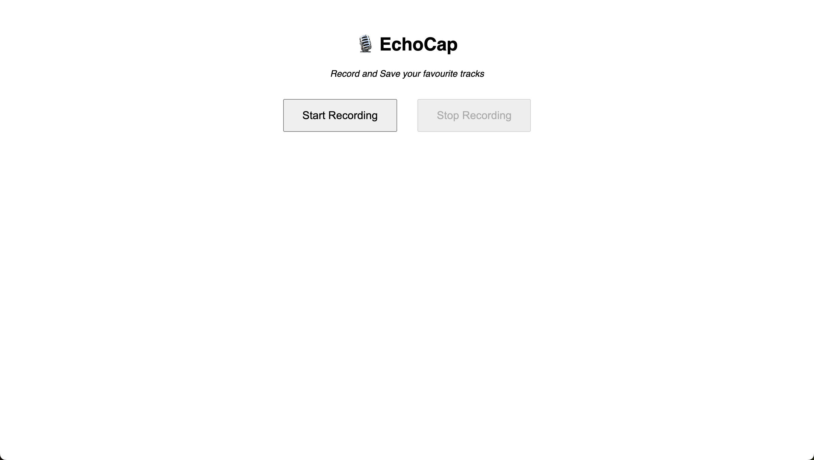

# 🎙️ EchoCap

EchoCap is a simple web app to **record audio from your screen** and save your favorite tracks.

## Features

- Record audio directly from your screen
- Save recordings as `.webm`
- Minimalistic, easy-to-use interface
- Works in modern browsers (Chrome, Edge, Firefox)

## Screenshots

### Recording Interface

## How to Use

1. Open `index.html` in a browser.
2. Click **Start Recording**.
3. Click **Stop Recording** to save the audio.
4. The file will be saved as `recording.webm`.

## Files

- `index.html` – main page  
- `style.css` – styles  
- `script.js` – recording logic  

## Notes

- Browser will ask for screen/audio permissions.  
- Works best on Chrome or Edge.  

## License

Open-source and free to use.
